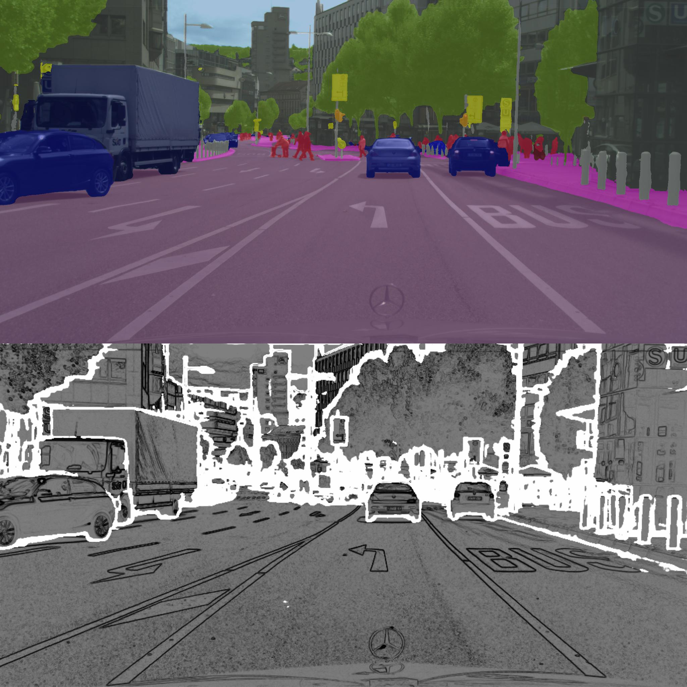

# Gated Shape CNNs
Implementation of [this paper](https://arxiv.org/abs/1907.05740) for semantic segmentation. Written using tensorflow 2.2.0rc3, and the model is implemented as a subclassed `tf.keras.Model`. 

There are some differences between this implementation and the paper: 
- Use Xception instead of WideResnet
- Only replace the final downsampling layers with atrous convolution (usually you replace both)
- Use generalised dice loss instead of cross entropy for the edge segmentation
- I accumulate gradients over iterations as I do not have 8 GPUS! Instead of batch size of 2 synchronised on 8 GPUS i have a batch of size 4 accumulating 4 passes.
- train on a smaller resolution 700x700 versus 800x800


## Performance on CityScapes

Implementation| mean     | road | sidewalk  | building | wall | fence | pole| traffic light | traffic sign | vegetation | terrain | sky | person | rider | car | truck | bus | train | motorcycle | bicycle|
| ---         |    ---   | ---  | ---       | ---      | ---  | ---   | --- | ---           | ---          | ---        | ---     | --- | ---    | ---   | --- | ---   | --- | ---   | ---        | ---    |
| Paper       |   80.8   | 98.3 | 86.3      |93.3      |55.8  |64     |70.8 |75.9           |83.1          |93          |65.1     |95.2 |85.3    |67.9   |96   |80.8   |91.2 |83.3   |69.6        |80.4    |
| This repo   |   77.7   | 97.8 | 83.2      |92.4      |55.8  |59.8   |64.4 |67.6           |77.5          |92.4        |63       |94.9 |81.9    |63     |95   |80.8   |86   |78.3   |65.2        |77.1   |

<div align="center">

</div>

<div align="center">

</div>

## model weights

[Model weights](https://drive.google.com/open?id=1wZRoMeCP25Qcrm33aMjT1Hm6zynS4dsB) includes the weights, and training tensorboard logs.

## Requires
Only tested on tensorflow==2.2.0rc3. There are definitely things which will not work with earlier versions of tensorflow.


## Training on your own data
If you want to train on your own data then you need to 
- subclass the Dataset class and define two methods for an example see `datasets.cityscapes.dataset`:
- alternatively you just need to pass a training and validation `tf.data.Dataset` to the a `gscnn.train_and_evaluate.Trainer` which you   can iterate over like:
```python
for im, label, edge_label in self.train_dataset:
    # im         [b, h, w, 3]       tf.float32
    # label      [b, h, w, classes] tf.float32
    # edge_label [b, h, w, 2]       tf.float32
    pass
```
- input needs to be have 3 channels (RGB) but would be easy to make more general, but you'll have to write some code
- Define training setup, see `cityscapes_model.py`

## Todo 
- Write tests
- add ci/cd so look like I know what I am doing

